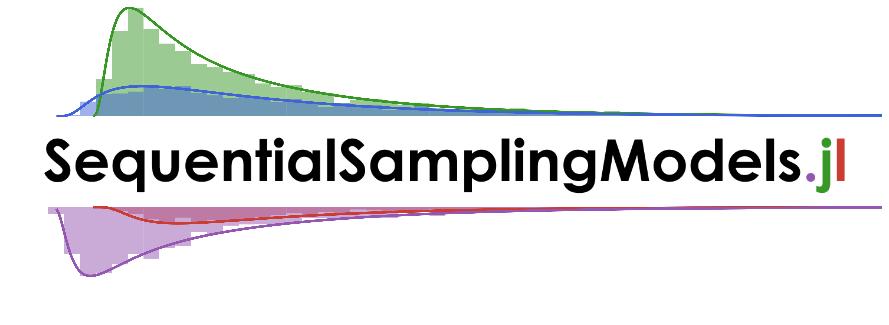

[](https://itsdfish.github.io/SequentialSamplingModels.jl/dev/)

[](https://itsdfish.github.io/SequentialSamplingModels.jl/dev/) [](https://github.com/itsdfish/SequentialSamplingModels.jl/actions/workflows/CI.yml)

# SequentialSamplingModels

This package provides a unified interface for simulating and evaluating sequential sampling models (SSMs) in Julia. SSMs describe decision making as a stochastic and dynamic evidence accumulation process in which a decision is triggered by the option whose evidence hits a decision treshold first. 

# Feature Overview

A summary of the core features is provided below. Please see the [documentation](https://itsdfish.github.io/SequentialSamplingModels.jl/dev/) for more information.

## Supported Models
The following SSMs are supported :

- [Attentional Drift Diffusion](https://itsdfish.github.io/SequentialSamplingModels.jl/dev/aDDM/)
- [Circular Drift Diffusion](https://itsdfish.github.io/SequentialSamplingModels.jl/dev/cddm/) 
- [Drift Diffusion](https://itsdfish.github.io/SequentialSamplingModels.jl/dev/DDM/)
- [Leaking Competing Accumulator](https://itsdfish.github.io/SequentialSamplingModels.jl/dev/lca/)
- [Linear Ballistic Accumulator](https://itsdfish.github.io/SequentialSamplingModels.jl/dev/lba/) 
- [Log Normal Race](https://itsdfish.github.io/SequentialSamplingModels.jl/dev/lnr/) 
- [Multi-attribute Attentional Drift Diffusion](https://itsdfish.github.io/SequentialSamplingModels.jl/dev/maaDDM/)
- [Racing Diffusion](https://itsdfish.github.io/SequentialSamplingModels.jl/dev/rdm/) 
- [Wald](https://itsdfish.github.io/SequentialSamplingModels.jl/dev/wald/) 
- [Wald Mixture](https://itsdfish.github.io/SequentialSamplingModels.jl/dev/wald_mixture/)

## API

The core API consists of the following 

- rand: generate simulated data 
- pdf: evaluate the probability density of the data
- logpdf: evaluate the log probability density of the data
- simulate: generate samples from the internal evidence accumulation process
## Ecosystem Integration

SSMs work with the following packages (and possibly more):

- [Distributions.jl](https://github.com/JuliaStats/Distributions.jl): functions for probability distributions
- [Pigeons.jl](http://pigeons.run/dev/): Bayesian parameter estimation and Bayes factors
- [Plots.jl](https://github.com/JuliaPlots/Plots.jl): extended plotting tools for SSMs
- [Turing.jl](https://turinglang.org/dev/docs/using-turing/get-started): Bayesian parameter estimation

## Installation

You can install a stable version of *SequentialSamplingModels* by running the following in the Julia REPL:

```julia
] add SequentialSamplingModels
```

## Quick Example

In the example below, we instantiate a Linear Ballistic Accumulator (LBA) model, and generate data from it.

```julia
using SequentialSamplingModels
using StatsPlots
using Random

# Create LBA distribution with known parameters
dist = LBA(; ν=[2.75,1.75], A=0.8, k=0.5, τ=0.25)
# Sample 1000 random data points from this distribution
choice, rt = rand(dist, 1000)
```