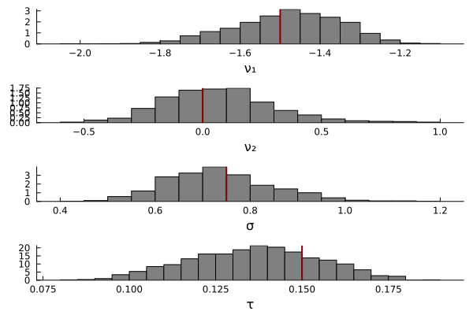

# Introduction

The purpose of this example is to illustrate Bayesian parameter estimation with a neural estimator called normalizing flows. Normalizing flows are a special type of invertible neural network which can learn the posterior distribution by learning the mapping between samples from the prior distribution and simulated data generated from the model. 

In the example below, we estimate the parameters of the [lognormal race model](lnr.md) (LNR; ). In pratice, one is unlikely to estimate the parameters of the LRN with neural networks because it has an analytic likelihood function. However, we use the LNR for illustration because it is fast to stimulate and the estimation properties of the LRN are known. You can reveal copy-and-pastable version of the full code by clicking the ▶ below. 

```@raw html
<details>
<summary><b>Show Full Code</b></summary>
```
```julia
using AlgebraOfGraphics
using CairoMakie
using Distributions
using Flux
using NeuralEstimators
using Random
using Plots
using SequentialSamplingModels

Random.seed!(544)

n = 2           # dimension of each data replicate 
m = 100         # number of independent replicates 
d = 4           # dimension of the parameter vector θ
w = 128         # width of each hidden layer 

function sample_prior(K)
    ν = rand(Normal(-2, 3), K, 2)
    σ = rand(truncated(Normal(1, 3), 0, Inf), K)
    τ = rand(Uniform(0.100, 0.300), K)
    θ = vcat(ν', σ', τ')
    return θ
end

to_array(x) = Float32[x.choice'; x.rt']
simulate(θ, m) = [to_array(rand(LNR(ϑ[1:2], ϑ[3], ϑ[4]), m)) for ϑ ∈ eachcol(θ)]

# Approximate distribution
approx_dist = NormalisingFlow(d, 2d)

# Neural network mapping data to summary statistics (of the same dimension used in the approximate distribution)
ψ = Chain(x -> log.(x), Dense(n, w, relu), Dense(w, w, relu))
ϕ = Chain(Dense(w, w, relu), Dense(w, 2d))
network = DeepSet(ψ, ϕ)

# Initialise a neural posterior estimator
estimator = PosteriorEstimator(approx_dist, network)

# Train the estimator
estimator = train(
    estimator, 
	sample_prior, 
	simulate; 
	m, 
	K = 25_000
)

# Assess the estimator
θ_test = sample_prior(1000)
data_test = simulate(θ_test, m)
assessment = assess(estimator, θ_test, data_test; parameter_names = ["ν₁", "ν₂", "σ", "τ"])
bias(assessment)
rmse(assessment)
recovery_plot = AlgebraOfGraphics.plot(assessment)

# perform Bayesian parameter estimation on simulated data 
θ = [-1.5, 0, 0.75, 0.250]       
data = simulate(θ, m)        
post_samples = sampleposterior(estimator, data)
Plots.histogram(
    post_samples',
    layout = (4, 1),
    color = :grey,
    norm = true,
    leg = false,
    grid = false,
    xlabel = ["ν₁" "ν₂" "σ" "τ"]
)
vline!([θ'], color = :darkred, linewidth = 2)
```
```@raw html
</details>
```

# Load Dependencies

The first step is to load the dependencies. `NeuralEstimators` and `Flux` are the primary packages for performing Bayesian parameter estimation with normalizing flows. We will also load `AlgebraOfGraphics`, `CairoMakie`, and `Plots` to visualize the parameter recovery and posterior distributions. 

```julia
using AlgebraOfGraphics
using CairoMakie
using Distributions
using Flux
using NeuralEstimators
using Random
using Plots
using SequentialSamplingModels
```

In the code block below, we set the seed for the random number generator so that the results are reproducible. 
```julia
Random.seed!(544)
```

# Simulation Functions

As previously noted, normalizing flow neural networks learn the mapping between the prior distribution and simulated data. Once that mapping is learned, the network is inverted to allow one to sample from posterior distribution. We define two functions to generate training data---one to sample from the prior distribution, and another to sample data from the model, given a sampled parameter vector from the prior distribution. In the code block below, the $K$ samples are generated from each prior and concatonated into a $4 \times K$ array. 

```julia
function sample_prior(K)
    ν = rand(Normal(-2, 3), K, 2)
    σ = rand(truncated(Normal(1, 3), 0, Inf), K)
    τ = rand(Uniform(0.100, 0.300), K)
    θ = vcat(ν', σ', τ')
    return θ
end
```

The code block below specifies the function `simulate` to sample simulated data from the model. In this function, $\theta$ is a $4 \times K$ array, with each column representing an independent sample from the prior distribution, and $m$ is the number of trials sampled from the model per sample from the prior. The helper function `to_array` transforms the data into the required format: an $m \times 2$ array in which the first column consists of choice indices, and the second column consists of reaction times. 

```julia
to_array(x) = Float32[x.choice'; x.rt']
simulate(θ, m) = [to_array(rand(LNR(ϑ[1:2], ϑ[3], ϑ[4]), m)) for ϑ ∈ eachcol(θ)]
```
# Configure Neural Network

In this section, we will configure the neural network to perform Bayesian parameter estimation. At a high level, the neural network has two main components. The first component is the `NormalisingFlow`, which learns the density of the model. The second component is the `DeepSet` which learns the summary statistics undelying the distributions. 
```julia
# Approximate distribution
approx_dist = NormalisingFlow(d, 2d)

# Neural network mapping data to summary statistics (of the same dimension used in the approximate distribution)
ψ = Chain(x -> log.(x), Dense(n, w, relu), Dense(w, w, relu))
ϕ = Chain(Dense(w, w, relu), Dense(w, 2d))
network = DeepSet(ψ, ϕ)

# Initialise a neural posterior estimator
estimator = PosteriorEstimator(approx_dist, network)
```

# Train the Neural Network

```julia
estimator = train(
    estimator, 
	sample_prior, 
	simulate; 
	m, 
	K = 25_000
)
```

# Assess the Accuracy of the Neural Network

As shown in the code block below, the package NeuralEstimators provides three ways to assess the accuracy of the neural network: `bias`, `rmse`, and scatter plots of the parameer recovery. The parameter recovery plots below indicate that the neural network learned the mapping well. 

```julia
θ_test = sample_prior(1000)
data_test = simulate(θ_test, m)
assessment = assess(estimator, θ_test, data_test; parameter_names = ["ν₁", "ν₂", "σ", "τ"])
bias(assessment)
rmse(assessment)
recovery_plot = AlgebraOfGraphics.plot(assessment)
```


# Perform Bayesian Parameter Estimation

Now that the neural network has been trained, we can perform Bayesian parameter estimation. In the example below, we simulate data from the model using parameters defined in the vector $\theta$. The estimator and data are passed to `sampleposterior`, which generates samples from the posterior distribution of parameters. As expected, the histogram shows that the posterior distributions are near the true parameter values, displayed as red vertical lines.

```julia
θ = [-1.5, 0, 0.75, 0.150]       
data = simulate(θ, m)        
post_samples = sampleposterior(estimator, data)
Plots.histogram(
    post_samples',
    layout = (4, 1),
    color = :grey,
    norm = true,
    leg = false,
    grid = false,
    xlabel = ["ν₁" "ν₂" "σ" "τ"]
)
vline!([θ'], color = :darkred, linewidth = 2)
```


# Save the Trained Neural Network

```julia
using BSON: @save 
using Flux

model_state = Flux.state(estimator)
@save "lnr_estimator.bson" model_state
```

You can load the trained neural network into a new Julia session with the `@load` macro from `BSON`. In order to successfully reuse the trained neural network, you will need to initialize the neural network before passing the trained parameters. You can reveal copy-and-pastable version of the full code by clicking the ▶ below. 

```@raw html
<details>
<summary><b>Show Full Code</b></summary>
```
```julia
using BSON: @load
using Distributions
using Flux
using NeuralEstimators
using SequentialSamplingModels

Random.seed!(544)

n = 2           # dimension of each data replicate 
m = 100         # number of independent replicates 
d = 4           # dimension of the parameter vector θ
w = 128         # width of each hidden layer 

# Approximate distribution
approx_dist = NormalisingFlow(d, 2d)

# Neural network mapping data to summary statistics (of the same dimension used in the approximate distribution)
ψ = Chain(x -> log.(x), Dense(n, w, relu), Dense(w, w, relu))
ϕ = Chain(Dense(w, w, relu), Dense(w, 2d))
network = DeepSet(ψ, ϕ)

# Initialise a neural posterior estimator
estimator = PosteriorEstimator(approx_dist, network)

# load the weights
@load "lnr_estimator.bson" model_state
Flux.loadmodel!(estimator, model_state)
```
```@raw html
</details>
```