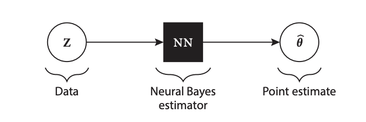
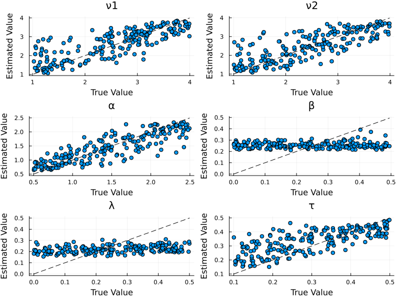

# Neural Parameter Estimation

Neural parameter estimation uses neural networks to perform parameter estimation by learning the mapping between simulated data and model parameters (for a detailed review, see Zammit-Mangion et al., 2024). Neural parameter estimation is particularly useful for models with computationally intractable likelihoods, such as the Leaky Competing Accumulator (LCA; Usher & McClelland, 2001). Once trained, neural networks can be saved and reused to perform inference rapidly across multiple datasets, or used for computationally intensive parameter recovery simulations to understand the quality of parameter estimates under ideal conditions.

Below, we demonstrate how to estimate parameters of the LCA model using the [NeuralEstimators.jl](https://github.com/msainsburydale/NeuralEstimators) package.

## Example

We'll estimate parameters of the LCA model, which is particularly challenging due to its complex dynamics, where parameters like leak rate (λ) and lateral inhibition (β) can be difficult to recover. This example draws from a more in-depth case that highlights many of the steps one ought to consider when utilizing amortized inference for cognitive modeling; see [Principled Amortized Bayesian Workflow for Cognitive Modeling](https://bayesflow.org/stable-legacy/_examples/LCA_Model_Posterior_Estimation.html).

## Load Packages

```julia 
using NeuralEstimators
using SequentialSamplingModels
using Flux
using Distributions
using Random

using Plots

Random.seed!(123)
```

## Define Parameter Sampling

Unlike traditional Bayesian inference methods, neural parameter estimation requires us to define two functions so that the neural network can learn the mapping between simulated data and parameters. One function samples parameters from a prior distribution, and the other generates simulated data based on a sampled parameter vector. While traditional methods like MCMC also sample from the prior, those samples are used directly during inference rather than to create a separate training dataset. 


*Schematic of neural parameter estimation. Once trained, the neural network provides a direct mapping from observed data (Z) to parameter estimates (θ̂), enabling rapid inference without the computational burden of traditional methods.*

In neural parameter estimation, we use the prior to sample a wide range of parameters and simulate corresponding data, which we then use to train a model (e.g., a neural network) to approximate a point estimate or the posterior. We use the following function to sample a range of parameters for training:

```julia 
# Function to sample parameters from priors
function sample(K::Integer)
    ν1 = rand(Gamma(2, 1/1.2f0), K)  # Drift rate 1
    ν2 = rand(Gamma(2, 1/1.2f0), K)  # Drift rate 2
    α = rand(Gamma(10, 1/6f0), K)    # Threshold
    β = rand(Beta(1, 5f0), K)        # Lateral inhibition
    λ = rand(Beta(1, 5f0), K)        # Leak rate
    τ = rand(Gamma(1.5, 1/5.0f0), K) # Non-decision time
    
    # Stack parameters into a matrix (d×K)
    θ = vcat(ν1', ν2', α', β', λ', τ')
    
    return θ
end
```

## Define Data Simulator

Neural estimators learn the mapping from data to parameters through simulation. Here we define a function to simulate LCA model data. To do so we will use the [LCA](https://itsdfish.github.io/SequentialSamplingModels.jl/dev/lca/).

```julia 
# Function to simulate data from the LCA model
function simulate(θ, n_trials_per_param)
    # Simulate data for each parameter vector
    simulated_data = map(eachcol(θ)) do param
        # Extract parameters for this model
        ν1, ν2, α, β, λ, τ = param
        ν = [ν1, ν2]   # Two-choice LCA
        
        # Create LCA model with SSM
        model = LCA(; ν, α, β, λ, τ)
        
        # Generate choices and reaction times
        choices, rts = rand(model, n_trials_per_param)
        
        # Return as a transpose matrix where each column is a trial 
        return Float32.([choices rts]')

    end
    
    return simulated_data
end
```

## Define Neural Network Architecture

For LCA parameter recovery, we use a DeepSet architecture which respects the permutation invariance of trial data. For more details on the method [see NeuralEstimators.jl documentation](https://msainsburydale.github.io/NeuralEstimators.jl/dev/API/architectures/#NeuralEstimators.DeepSet). To construct the network architecture we will use the Flux.jl package.

```julia 
# Create neural network architecture for parameter recovery
function create_neural_estimator(;
    ν_bounds = (0.1, 6.0),
    α_bounds = (0.3, 4.5),
    β_bounds = (0.0, 0.8),
    λ_bounds = (0.0, 0.8),
    τ_bounds = (0.100, 2.0)
)
    # Unpack defined parameter Bounds
    ν_min, ν_max = ν_bounds              # Drift rates
    α_min, α_max = α_bounds              # Threshold
    β_min, β_max = β_bounds              # Lateral inhibition
    λ_min, λ_max = λ_bounds              # Leak rate
    τ_min, τ_max = τ_bounds              # Non-decision time

    # Input dimension: 2 (choice and RT for each trial)
    n = 2
    # Output dimension: 6 parameters
    d = 6  # ν[1], ν[2], α, β, λ, τ
    # Width of hidden layers
    w = 128
    
    # Inner network - processes each trial independently
    ψ = Chain(
        Dense(n, w, relu),
        Dense(w, w, relu),
        Dense(w, w, relu)
    )
    
    # Final layer with parameter constraints
    final_layer = Parallel(
        vcat,
        Dense(w, 1, x -> ν_min + (ν_max - ν_min) * σ(x)),     # ν1
        Dense(w, 1, x -> ν_min + (ν_max - ν_min) * σ(x)),     # ν2
        Dense(w, 1, x -> α_min + (α_max - α_min) * σ(x)),     # α
        Dense(w, 1, x -> β_min + (β_max - β_min) * σ(x)),     # β
        Dense(w, 1, x -> λ_min + (λ_max - λ_min) * σ(x)),     # λ
        Dense(w, 1, x -> τ_min + (τ_max - τ_min) * σ(x))      # τ
    )
    
    # Outer network - maps aggregated features to parameters
    ϕ = Chain(
        Dense(w, w, relu),
        Dense(w, w, relu),
        final_layer
    )
    
    # Combine into a DeepSet
    network = DeepSet(ψ, ϕ)
    
    # Initialize neural Bayes estimator
    estimator = PointEstimator(network)
    
    return estimator
end
```

The result of our constructed neural network is a point estimator that corresponds to a Bayes estimator, which is a functional of the posterior distribution. Under the specified loss function, this point estimate corresponds to the posterior mean. For details on the theoretical foundations of neural Bayes estimators, see Sainsbury-Dale et al. (2024).

## Training the Neural Estimator

Neural estimators, like all deep learning methods, require a training phase during which they learn the mapping from data to parameters. Here, we train the estimator by simulating data on the fly: the sampler provides new parameter vectors from the prior, and the simulator generates corresponding data conditional on those parameters. Since we use online training and the network never sees the same simulated dataset twice, overfitting is less likely. For more details on training, see the API for arguments [here](https://msainsburydale.github.io/NeuralEstimators.jl/dev/API/core/#Training).

```julia 
# Create the neural estimator
estimator = create_neural_estimator()

# Train network
trained_estimator = train(
    estimator,
    sample,                     # Parameter sampler function
    simulate,                   # Data simulator function
    m = 100,                    # Number of trials per parameter vector
    K = 10000,                  # Number of training parameter vectors
    K_val = 2000,               # Number of validation parameter vectors
    loss = Flux.mae,            # Mean absolute error loss
    epochs = 60,                # Number of training epochs
    epochs_per_Z_refresh = 1,   # Refresh data every epoch
    epochs_per_θ_refresh = 5,   # Refresh parameters every 5 epochs
    batchsize = 16,             # Batch size for training
    verbose = true
)
```

## Assessing Estimator Performance

We can assess the performance of our trained estimator on held-out test data:

```julia 
# Generate test data
n_test = 500
θ_test = sample(n_test)
Z_test = simulate(θ_test, 500)

# Assess the estimator
parameter_names = ["ν1", "ν2", "α", "β", "λ", "τ"]
assessment = assess(
    trained_estimator, 
    θ_test, 
    Z_test; 
    parameter_names = parameter_names
)

# Calculate performance metrics
bias_results = bias(assessment)
rmse_results = rmse(assessment)
println("Bias: ", bias_results)
println("RMSE: ", rmse_results)
```

## Visualizing Parameter Recovery

A key advantage of neural estimation is the ability to quickly conduct inference after training. For example, we can visualize the recovery of parameters. While NeuralEstimators provides built-in visualization capabilities through the [AlgebraOfGraphics.jl](https://github.com/MakieOrg/AlgebraOfGraphics.jl), we will demonstrate custom plotting below:

```julia 
# Extract data from assessment
df = assessment.df

# Create recovery plots for each parameter
params = unique(df.parameter)
p_plots = []

for param in params
    param_data = filter(row -> row.parameter == param, df)
    
    # Calculate correlation coefficient
    truth = param_data.truth
    estimate = param_data.estimate
    correlation = cor(truth, estimate)
    
    # Create plot
    p = scatter(
        truth, 
        estimate,
        xlabel="Ground Truth",
        ylabel="Estimated",
        title=param,
        legend=false
    )
    
    # Add diagonal reference line
    plot!(p, [minimum(truth), maximum(truth)], 
          [minimum(truth), maximum(truth)], 
          line=:dash, color=:black)
    
    # Get current axis limits after plot is created
    x_min, x_max = xlims(p)
    y_min, y_max = ylims(p)
    
    # Position text at the top-left corner of the plot
    annotate!(p, x_min + 0.1, y_max, text("R = $(round(correlation, digits=3))", :left, 10))
    
    push!(p_plots, p)
end

# Combine plots
p_combined = plot(p_plots..., layout=(3,2), size=(800, 600))
display(p_combined)
```


## Using the Trained Estimator

Once trained, the estimator can instantly recover parameters from new data via a forward pass:

```julia 
# Generate "observed" data
ν = [2.5, 2.0]
α = 1.5
β = 0.2
λ = 0.1
τ = 0.3

# Create model and generate data
true_model = LCA(; ν, α, β, λ, τ)
observed_choices, observed_rts = rand(true_model, 100)

# Format the data
observed_data = Float32.([observed_choices observed_rts]')

# Recover parameters
recovered_params = NeuralEstimators.estimate(trained_estimator, [observed_data])

# Compare true and recovered parameters
println("True parameters: ", [ν[1], ν[2], α, β, λ, τ])
println("Recovered parameters: ", recovered_params)
```

## Notes on Performance

Neural estimators are particularly effective for models with computationally intractable likelihoods like the LCA model. However, certain parameters (particularly β and λ) can be difficult to recover, even with advanced neural network architectures. This is a property of the LCA model rather than a limitation of the estimation technique. 

Additional details can be found in the [NeuralEstimators.jl documentation](https://github.com/msainsburydale/NeuralEstimators).

# Complete Code
```@raw html
<details>
<summary><b>Show Details</b></summary>
```
```julia
using NeuralEstimators
using SequentialSamplingModels
using Flux
using Distributions
using Random
using Plots

Random.seed!(123)

# Function to sample parameters from priors
function sample(K::Integer)
    ν1 = rand(Gamma(2, 1/1.2f0), K)  # Drift rate 1
    ν2 = rand(Gamma(2, 1/1.2f0), K)  # Drift rate 2
    α = rand(Gamma(10, 1/6f0), K)    # Threshold
    β = rand(Beta(1, 5f0), K)        # Lateral inhibition
    λ = rand(Beta(1, 5f0), K)        # Leak rate
    τ = rand(Gamma(1.5, 1/5.0f0), K) # Non-decision time
    
    # Stack parameters into a matrix (d×K)
    θ = vcat(ν1', ν2', α', β', λ', τ')
    
    return θ
end

# Function to simulate data from the LCA model
function simulate(θ, n_trials_per_param)
    # Simulate data for each parameter vector
    simulated_data = map(eachcol(θ)) do param
        # Extract parameters for this model
        ν1, ν2, α, β, λ, τ = param
        ν = [ν1, ν2]   # Two-choice LCA
        
        # Create LCA model with SSM
        model = LCA(; ν, α, β, λ, τ)
        
        # Generate choices and reaction times
        choices, rts = rand(model, n_trials_per_param)
        
        # Return as a transpose matrix where each column is a trial 
        return Float32.([choices rts]')

    end
    
    return simulated_data
end

# Create neural network architecture for parameter recovery
function create_neural_estimator(;
    ν_bounds = (0.1, 6.0),
    α_bounds = (0.3, 4.5),
    β_bounds = (0.0, 0.8),
    λ_bounds = (0.0, 0.8),
    τ_bounds = (0.100, 2.0)
)
    # Unpack defined parameter Bounds
    ν_min, ν_max = ν_bounds              # Drift rates
    α_min, α_max = α_bounds              # Threshold
    β_min, β_max = β_bounds              # Lateral inhibition
    λ_min, λ_max = λ_bounds              # Leak rate
    τ_min, τ_max = τ_bounds              # Non-decision time

    # Input dimension: 2 (choice and RT for each trial)
    n = 2
    # Output dimension: 6 parameters
    d = 6  # ν[1], ν[2], α, β, λ, τ
    # Width of hidden layers
    w = 128
    
    # Inner network - processes each trial independently
    ψ = Chain(
        Dense(n, w, relu),
        Dense(w, w, relu),
        Dense(w, w, relu)
    )
    
    # Final layer with parameter constraints
    final_layer = Parallel(
        vcat,
        Dense(w, 1, x -> ν_min + (ν_max - ν_min) * σ(x)),     # ν1
        Dense(w, 1, x -> ν_min + (ν_max - ν_min) * σ(x)),     # ν2
        Dense(w, 1, x -> α_min + (α_max - α_min) * σ(x)),     # α
        Dense(w, 1, x -> β_min + (β_max - β_min) * σ(x)),     # β
        Dense(w, 1, x -> λ_min + (λ_max - λ_min) * σ(x)),     # λ
        Dense(w, 1, x -> τ_min + (τ_max - τ_min) * σ(x))      # τ
    )
    
    # Outer network - maps aggregated features to parameters
    ϕ = Chain(
        Dense(w, w, relu),
        Dense(w, w, relu),
        final_layer
    )
    
    # Combine into a DeepSet
    network = DeepSet(ψ, ϕ)
    
    # Initialize neural Bayes estimator
    estimator = PointEstimator(network)
    
    return estimator
end

# Create the neural estimator
estimator = create_neural_estimator()

# Train network
trained_estimator = train(
    estimator,
    sample,                     # Parameter sampler function
    simulate,                   # Data simulator function
    m = 100,                    # Number of trials per parameter vector
    K = 10000,                  # Number of training parameter vectors
    K_val = 2000,               # Number of validation parameter vectors
    loss = Flux.mae,            # Mean absolute error loss
    epochs = 60,                # Number of training epochs
    epochs_per_Z_refresh = 1,   # Refresh data every epoch
    epochs_per_θ_refresh = 5,   # Refresh parameters every 5 epochs
    batchsize = 16,             # Batch size for training
    verbose = true
)

# Generate test data
n_test = 500
θ_test = sample(n_test)
Z_test = simulate(θ_test, 500)

# Assess the estimator
parameter_names = ["ν1", "ν2", "α", "β", "λ", "τ"]
assessment = assess(
    trained_estimator, 
    θ_test, 
    Z_test; 
    parameter_names = parameter_names
)

# Calculate performance metrics
bias_results = bias(assessment)
rmse_results = rmse(assessment)
println("Bias: ", bias_results)
println("RMSE: ", rmse_results)

# Extract data from assessment
df = assessment.df

# Create recovery plots for each parameter
params = unique(df.parameter)
p_plots = []

for param in params
    param_data = filter(row -> row.parameter == param, df)
    
    # Calculate correlation coefficient
    truth = param_data.truth
    estimate = param_data.estimate
    correlation = cor(truth, estimate)
    
    # Create plot
    p = scatter(
        truth, 
        estimate,
        xlabel="Ground Truth",
        ylabel="Estimated",
        title=param,
        legend=false
    )
    
    # Add diagonal reference line
    plot!(p, [minimum(truth), maximum(truth)], 
          [minimum(truth), maximum(truth)], 
          line=:dash, color=:black)
    
    # Get current axis limits after plot is created
    x_min, x_max = xlims(p)
    y_min, y_max = ylims(p)
    
    # Position text at the top-left corner of the plot
    annotate!(p, x_min + 0.1, y_max, text("R = $(round(correlation, digits=3))", :left, 10))
    
    push!(p_plots, p)
end

# Combine plots
p_combined = plot(p_plots..., layout=(3,2), size=(800, 600))
display(p_combined)

# Generate "observed" data
ν = [2.5, 2.0]
α = 1.5
β = 0.2
λ = 0.1
τ = 0.3

# Create model and generate data
true_model = LCA(; ν, α, β, λ, τ)
observed_choices, observed_rts = rand(true_model, 100)

# Format the data
observed_data = Float32.([observed_choices observed_rts]')

# Recover parameters
recovered_params = NeuralEstimators.estimate(trained_estimator, [observed_data])

# Compare true and recovered parameters
println("True parameters: ", [ν[1], ν[2], α, β, λ, τ])
println("Recovered parameters: ", recovered_params)
```
```@raw html
</details>
```

# References

Miletić, S., Turner, B. M., Forstmann, B. U., & van Maanen, L. (2017). Parameter recovery for the leaky competing accumulator model. Journal of Mathematical Psychology, 76, 25-50.

Sainsbury-Dale, Matthew, Andrew Zammit-Mangion, and Raphaël Huser. "Likelihood-free parameter estimation with neural Bayes estimators." The American Statistician 78.1 (2024): 1-14.

Radev, S. T., Schmitt, M., Schumacher, L., Elsemüller, L., Pratz, V., Schälte, Y., ... & Bürkner, P. C. (2023). BayesFlow: Amortized Bayesian workflows with neural networks. arXiv preprint arXiv:2306.16015.

Usher, M., & McClelland, J. L. (2001). The time course of perceptual choice: The leaky, competing accumulator model. Psychological Review, 108 3, 550–592. https://doi.org/10.1037/0033-295X.108.3.550

Zammit-Mangion, Andrew, Matthew Sainsbury-Dale, and Raphaël Huser. "Neural methods for amortized inference." Annual Review of Statistics and Its Application 12 (2024).