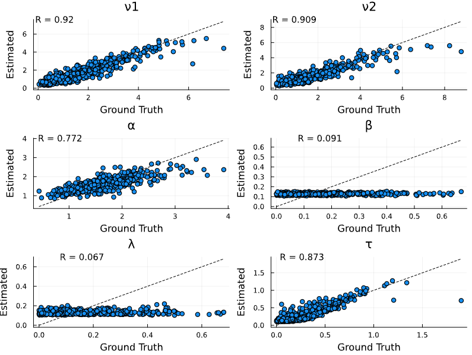

# Neural Parameter Estimation

Neural parameter estimation provides a likelihood-free approach to parameter recovery, especially useful for models with computationally intractable likelihoods. This method is based on training neural networks to learn the mapping from data to parameters. Once trained, these networks can perform inference rapidly across multiple datasets, making them particularly valuable for models like the Leaky Competing Accumulator (LCA).

Below, we demonstrate how to estimate parameters of the LCA model using the [NeuralEstimators.jl](https://github.com/msainsburydale/NeuralEstimators) package.

## Example

We'll estimate parameters of the LCA model, which is particularly challenging due to its complex dynamics where parameters like leak rate (λ) and lateral inhibition (β) can be difficult to recover.

## Load Packages

```julia
using NeuralEstimators
using SequentialSamplingModels
using Flux
using Distributions
using Random

using Plots

Random.seed!(123)
```

## Define Parameter Bounds

```julia
# Define parameter bounds for the LCA model
const ν_min, ν_max = 0.1, 4.0      # Drift rates
const α_min, α_max = 0.5, 3.5      # Threshold
const β_min, β_max = 0.0, 0.5      # Lateral inhibition
const λ_min, λ_max = 0.0, 0.5      # Leak rate
const τ_min, τ_max = 0.1, 0.5      # Non-decision time
```

## Define Parameter Sampling

Unlike traditional Bayesian approaches, simulation based inference methods require us to define a prior sampling function to generate training data. We will use this function to sample a range of parameters for training:

```julia
# Function to sample parameters from priors
function sample(K::Integer)
    ν1 = rand(Gamma(2, 1/1.2), K)  # Drift rate 1
    ν2 = rand(Gamma(2, 1/1.2), K)  # Drift rate 2
    α = rand(Gamma(10, 1/6), K)    # Threshold
    β = rand(Beta(1, 5), K)        # Lateral inhibition
    λ = rand(Beta(1, 5), K)        # Leak rate
    τ = rand(Gamma(1.5, 1/5.0), K) # Non-decision time
    
    # Stack parameters into a matrix (d×K)
    θ = vcat(ν1', ν2', α', β', λ', τ')
    
    return θ
end
```

## Define Data Simulator

Neural estimators learn the mapping from data to parameters through simulation. Here we define a function to simulate LCA model data. To do so we will use the LCA function from SequentialSamplingModels.

```julia
# Function to simulate data from the LCA model
function simulate(θ, n_trials_per_param)
    # Simulate data for each parameter vector
    simulated_data = map(eachcol(θ)) do param
        # Extract parameters for this model
        ν1, ν2, α, β, λ, τ = param
        ν = [ν1, ν2]  # Two-choice LCA
        σ = 1.0        # Fixed diffusion noise
        
        # Create LCA model
        model = LCA(; ν, α, β, λ, τ, σ)
        
        # Generate choices and reaction times
        choices, rts = rand(model, n_trials_per_param)
        
        # Return as a transpose matrix where each column is a trial 
        return Float32.([choices rts]')
    end
    
    return simulated_data
end
```

## Define Neural Network Architecture

For LCA parameter recovery, we use a DeepSet architecture which respects the permutation invariance of trial data. For more details on the method see NeuralEstimators.jl documentation. To construct the network architecture we will use the Flux.jl package.

```julia
# Create neural network architecture for parameter recovery
function create_neural_estimator()
    # Input dimension: 2 (choice and RT for each trial)
    n = 2
    # Output dimension: 6 parameters
    d = 6  # ν[1], ν[2], α, β, λ, τ
    # Width of hidden layers
    w = 128
    
    # Inner network - processes each trial independently
    ψ = Chain(
        Dense(n, w, relu),
        Dense(w, w, relu),
        Dense(w, w, relu)
    )
    
    # Final layer with parameter constraints
    final_layer = Parallel(
        vcat,
        Dense(w, 1, x -> ν_min + (ν_max - ν_min) * σ(x)),     # ν1
        Dense(w, 1, x -> ν_min + (ν_max - ν_min) * σ(x)),     # ν2
        Dense(w, 1, x -> α_min + (α_max - α_min) * σ(x)),     # α
        Dense(w, 1, x -> β_min + (β_max - β_min) * σ(x)),     # β
        Dense(w, 1, x -> λ_min + (λ_max - λ_min) * σ(x)),     # λ
        Dense(w, 1, x -> τ_min + (τ_max - τ_min) * σ(x))      # τ
    )
    
    # Outer network - maps aggregated features to parameters
    ϕ = Chain(
        Dense(w, w, relu),
        Dense(w, w, relu),
        final_layer
    )
    
    # Combine into a DeepSet
    network = DeepSet(ψ, ϕ)
    
    # Initialize neural Bayes estimator
    estimator = PointEstimator(network)
    
    return estimator
end
```

## Training the Neural Estimator

Neural estimators, like all deep learning methods, require a training phase where they learn the mapping from data to parameters. Here we will train the estimator, simulating data as we go where the sampler provides new parameter vectors from the prior, and a simulator can be provided to continuously simulate new data conditional on the parameters.

```julia
# Create the neural estimator
estimator = create_neural_estimator()

# Train with on-the-fly simulation
trained_estimator = train(
    estimator,
    sample,              # Parameter sampler function
    simulate,            # Data simulator function
    m = 100,             # Number of trials per parameter vector
    K = 1000,           # Number of training parameter vectors
    K_val = 200,        # Number of validation parameter vectors
    loss = Flux.mae,     # Mean absolute error loss
    epochs = 5,         # Number of training epochs
    epochs_per_Z_refresh = 1,  # Refresh data every epoch
    epochs_per_θ_refresh = 5,  # Refresh parameters every 5 epochs
    batchsize = 64,            # Batch size for training
    verbose = true
)
```

## Assessing Estimator Performance

We can assess the performance of our trained estimator on held-out test data:

```julia
# Generate test data
n_test = 100
θ_test = sample(n_test)
Z_test = simulate(θ_test, 100)

# Assess the estimator
parameter_names = ["ν1", "ν2", "α", "β", "λ", "τ"]
assessment = assess(
    trained_estimator, 
    θ_test, 
    Z_test; 
    parameter_names = parameter_names
)

# Calculate performance metrics
bias_results = bias(assessment)
rmse_results = rmse(assessment)
println("Bias: ", bias_results)
println("RMSE: ", rmse_results)
```

## Visualizing Parameter Recovery

A key advantage of neural estimation is the ability to quickly conduct inference after training. For example, we can visualize the recovery of parameters:

```julia
# Extract data from assessment
df = assessment.df

# Create recovery plots for each parameter
params = unique(df.parameter)
p_plots = []

for param in params
    param_data = filter(row -> row.parameter == param, df)
    p = scatter(
        param_data.truth, 
        param_data.estimate,
        xlabel="Ground Truth",
        ylabel="Estimated",
        title=param,
        legend=false
    )
    plot!(p, [minimum(param_data.truth), maximum(param_data.truth)], 
          [minimum(param_data.truth), maximum(param_data.truth)], 
          line=:dash, color=:black)
    push!(p_plots, p)
end

# Combine plots
p_combined = plot(p_plots..., layout=(3,2), size=(800, 600))
display(p_combined)
```


## Using the Trained Estimator

Once trained, the estimator can instantly recover parameters from new data via a forward pass:

```julia
# Generate "observed" data
ν = [2.5, 2.0]
α = 1.5
β = 0.2
λ = 0.1
τ = 0.3
σ = 1.0

# Create model and generate data
true_model = LCA(; ν, α, β, λ, τ, σ)
observed_choices, observed_rts = rand(true_model, 100)

# Format the data
observed_data = Float32.([observed_choices observed_rts]')

# Recover parameters
recovered_params = NeuralEstimators.estimate(trained_estimator, [observed_data])

# Compare true and recovered parameters
println("True parameters: ", [ν[1], ν[2], α, β, λ, τ])
println("Recovered parameters: ", recovered_params)
```

## Notes on Performance

Neural estimators are particularly effective for models with computationally intractable likelihoods like the LCA model. However, certain parameters (particularly β and λ) can be difficult to recover, even with advanced neural network architectures. This is a  property of the LCA model rather than a limitation of the estimation technique. 

Additional details can be found in the [NeuralEstimators.jl documentation](https://github.com/msainsburydale/NeuralEstimators).

# References

Miletić, S., Turner, B. M., Forstmann, B. U., & van Maanen, L. (2017). Parameter recovery for the leaky competing accumulator model. Journal of Mathematical Psychology, 76, 25-50.

Sainsbury-Dale, Matthew, Andrew Zammit-Mangion, and Raphaël Huser. "Likelihood-free parameter estimation with neural Bayes estimators." The American Statistician 78.1 (2024): 1-14.

Zammit-Mangion, Andrew, Matthew Sainsbury-Dale, and Raphaël Huser. "Neural methods for amortized inference." Annual Review of Statistics and Its Application 12 (2024).

Radev, S. T., Schmitt, M., Schumacher, L., Elsemüller, L., Pratz, V., Schälte, Y., ... & Bürkner, P. C. (2023). BayesFlow: Amortized Bayesian workflows with neural networks. arXiv preprint arXiv:2306.16015.
