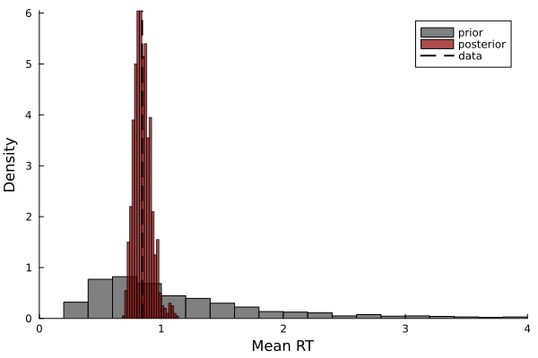
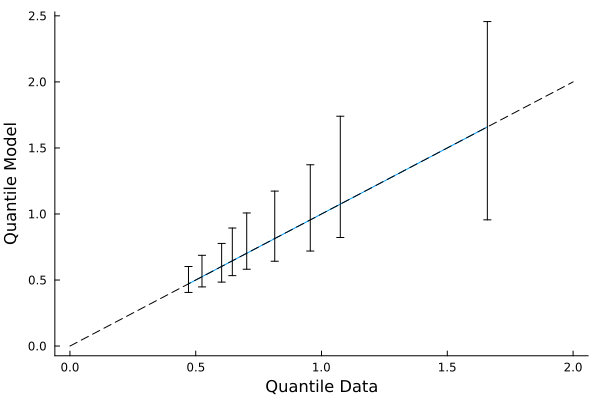
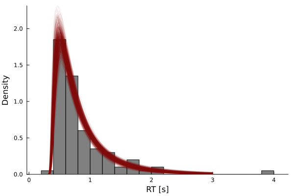

# Prior and Posterior Predictive Distributions

This tutorial explains the steps required for constructing and plotting prior and posterior predictive distributions of a sequential sampling models (SSMs). The primary function we will be using is `predict_distribution`, which allows you to generate prior or posterior predictive distributions from a given model. 

# Example 
The first step is to load the required packages and set the seed for the random number generator.

```julia 
using Distributions
using Plots
using Random
using SequentialSamplingModels
using Turing 
Random.seed!(1124)
```

## Generate Simulated Data
We will use the [Wald](wald.md) model as a simple example to illustrate how to create predictive distributions. The `Wald` model describes the evidence accumulation process underlying single detection decisions, such as respending when a stimulus appears. In the code block below, we will generate 50 data points.
```julia
n_samples = 100
rts = rand(Wald(ν=1.5, α=.8, τ=.3), n_samples)
```

## Define Turing Model 

Next, we will develop a Turing model for generating prior and posterior predictive distributions. You may develop the Turing model as usual, with one minor exception: you must return a `NamedTuple` of parameters. In the example below, $\nu$ and $\alpha$ are estimated, but $\tau$ is fixed. You may use any combination of estimated and fixed parameters.  

```julia
@model function wald_model(rts)
    ν ~ truncated(Normal(1.5, 1), 0, Inf)
    α ~ truncated(Normal(.8, 1), 0, Inf)
    τ = 0.3
    rts ~ Wald(ν, α, τ)
    return (;ν, α, τ)
end
```
In the next code block, we will pass the data and create a model object.
```julia 
model = wald_model(rts)
```
## Generate Prior Predictive Distribution
Generating a prior predictive distribution involves two steps: (1) sample from the prior, and (2) predict data or a statistic with the model evaluated at the prior samples. Below, we will sample 1,000 parameter vectors from the model. 
```julia 
prior_chain = sample(model, Prior(), 1000)
```

For the next step, we will generate predictions from the model using the parameters sampled from the prior distribution. When `Turing` is loaded, `SequentialSamplingModels` automatically loads `predict_distribution` into your session. The signature for `predict_distribution` is as follows:

```julia 
predict_distribution(dist, args...; model, func, n_samples, kwargs...)
```
`func` computes a statistic from simulated data of the model and has the general form `func(sim_data, args...; kwargs...)`. Thus, the only constraint is that `func` must recieve the simulated data as its first argument. `args...` and `kwargs...` are optionally pased to `func`. The remaining inputs are the model type `dist`, the Turing model object `model`, and the number of simulated observations `n_samples`.

As a simple illustration, we will compute the prior predictive mean by calling the following two functions. The first function creates a new function to sample from the predictive distribution and the second function `generated_quantities` performs the sampling.

```julia 
pred_model = predict_distribution(Wald; model, func=mean, n_samples)
prior_preds = generated_quantities(pred_model, prior_chain)
```

## Generate Posterior Predictive Distribution 

Generating a posterior predictive distribution involves a similar process. First, we will estimate the parameters from the data to obtain a chain of posterior samples. Next, we will generate the posterior predictive distribution using `generated_quantities`:

```julia 
post_chain = sample(model, NUTS(1000, .85), 1000)
post_preds = generated_quantities(pred_model, post_chain)
```

## Plot the Distributions

Now that we have generated the predictive distributions, we can compare them to the data by plotting them as a histogram. The histogram below reveals two insights: first, the data are centered near the prior and posterior predictive distributions, indicating they predict the data accurately; second, the posterior distribution is concentrated more closely around the data, indicating the information gain acquired during parameter estimation. 

```julia
histogram(prior_preds[:], xlims=(0,4), xlabel="Mean RT", ylabel="Density", norm=true, 
    color=:grey, label="prior", grid=false)
histogram!(post_preds[:], alpha=.7, color=:darkred, norm=true, label="posterior", grid=false)
vline!([mean(rts)], linestyle=:dash, color=:black, linewidth=2, label="data")
```

## Posterior Predictive Distribution of Quantiles
One goal of SSMs is to accurately characterize the distribution of reaction times. The previous example only evaluated one aspective of the model---namely, the predicted mean. Given the interest in characterizing the shape of the RT distribution, we need a different method. One method for evaluating the model's ability to capture the shape of the distribution is to compare the quantiles. In the example below, the quantiles of the data and model are evaluated at the deciles: $[.1,.2,\dots, .9]$. If the model matches the data accurately, the quantiles will fall along the identity line.  

```julia 
pred_quantiles = predict_distribution(Wald; model, func=compute_quantiles, n_samples=20)
post_quantile_preds = generated_quantities(pred_quantiles, post_chain)
q_data = compute_quantiles(rts)
plot_quantiles(q_data, post_quantile_preds)
```


The posterior predictive quantile-quantile plot above shows that the model fits the reaction time distribution well. This close match is to be expected, as we generated the data from the same model. 

## Posterior Predictive Distribution of Densities

As an alternative to a quantile-quantile plot, we can evaluate the probability density function of the model at a series of time points and plot the densities against the histogram or kernel density of the data. In the current example, we will plot the posterior predictive densities against a normalized histogram of the data because the kernel density is unstable with only 100 data points.

```julia
t_range = range(.2, 3, length=150)
pred_density = predict_density(Wald; model, t_range)
post_density_preds = generated_quantities(pred_density, post_chain)
histogram(rts, color=:grey, grid=false, norm=true, xlabel="RT [s]", ylabel="Density")
plot!(t_range, post_density_preds[:], alpha =.05, leg=false, color=:darkred)
```
